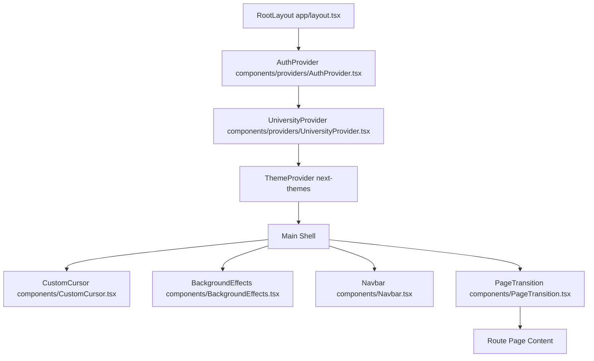

# Aevos: Frontend Architecture Blueprint & AI Hand-off Document

This document is a comprehensive, production-grade frontend architectural blueprint for Aevos. It is designed to allow external AI coding assistants, UI engineers, and design systems to instantly comprehend the current implementation, layout patterns, motion systems, and state architectures of the application.

---

## 1. System Overview & Core Functionality

Aevos is a high-fidelity academic tracking observatory designed for university students to simulate, forecast, and log their GPA (SGPA/CGPA) calculations. It supports:
- **Preset Grading Schemes**: Adapts grading and SGPA calculations dynamically based on custom university configurations (e.g., JSPM's 10-point scale vs. SPPU's grading patterns).
- **Target Projection**: Backwards-calculates the exact GPA milestones needed in upcoming semesters to hit a target CGPA.
- **Setback Scenarios**: Simulates the specific GPA drop and recovery roadmap required if backlog/failed courses occur.
- **Strategy & Marks Prediction**: Predicts minimum raw marks needed in the End Semester exams based on custom internal exam rules (e.g., Best of T1/T2, assignment weightage, labs vs. theory structures).
- **Dashboard & Trend Analytics**: Persists academic data locally and in a Postgres cloud database, offering interactive trend lines, performance breakdown, and semester-over-semester history comparison.

---

## 2. Technical Stack

The frontend is built using a modern, reactive stack:
- **Core Framework**: [Next.js 14 (App Router)](file:///c:/Users/Tanmay/OneDrive/Desktop/Aevos/gradeflow/next.config.mjs) utilizing TypeScript.
- **Styling Engine**: [Tailwind CSS](file:///c:/Users/Tanmay/OneDrive/Desktop/Aevos/gradeflow/tailwind.config.ts) + custom premium utility classes in [globals.css](file:///c:/Users/Tanmay/OneDrive/Desktop/Aevos/gradeflow/app/globals.css).
- **Animation System**: [Framer Motion](file:///c:/Users/Tanmay/OneDrive/Desktop/Aevos/gradeflow/lib/animation-constants.ts) for hardware-accelerated transitions, micro-interactions, magnetic cursors, and layout transitions.
- **Data Visualization**: [Recharts](file:///c:/Users/Tanmay/OneDrive/Desktop/Aevos/gradeflow/components/dashboard/TrendChartSection.tsx) for interactive SVG charts (radar, line, area, radial-gauge).
- **Form Verification**: [Zod](file:///c:/Users/Tanmay/OneDrive/Desktop/Aevos/gradeflow/lib/validations.ts) schemas for type-safe forms.
- **Database & Sync**: [Prisma Client](file:///c:/Users/Tanmay/OneDrive/Desktop/Aevos/gradeflow/lib/prisma.ts) for PostgreSQL ORM.
- **Identity & Authentication**: [NextAuth.js](file:///c:/Users/Tanmay/OneDrive/Desktop/Aevos/gradeflow/lib/auth.ts) for session management and route protection.

---

## 3. Folder & Route Architecture

```
gradeflow/
├── app/                          # Next.js App Router root
│   ├── api/                      # Backend API routes
│   │   ├── auth/                 # NextAuth handlers
│   │   ├── calculations/         # CRUD for calculations
│   │   ├── export/               # CSV/PDF data export
│   │   ├── plans/                # CRUD for semester plans
│   │   └── register/             # User signup endpoint
│   ├── backlog/                  # Backlog Impact Simulator Page
│   ├── calculator/               # Interactive GPA Calculator Page
│   ├── dashboard/                # Analytics & History Dashboard Page
│   │   └── DashboardClient.tsx   # Client dashboard wrapper
│   ├── login/                    # Auth - Login Page
│   ├── planner/                  # Semester Target Planner Page
│   ├── predictor/                # Strategy & Marks Predictor Page
│   ├── register/                 # Auth - Register Page
│   ├── timeline/                 # Interactive Curriculum Roadmap Page
│   ├── globals.css               # Theme variables, custom styling & animations
│   ├── layout.tsx                # Global Root Layout
│   └── page.tsx                  # Home Landing Page
├── components/                   # Reusable React components
│   ├── dashboard/                # Dashboard subcomponents
│   │   ├── ActivityTimeline.tsx  # Logs chronological student activities
│   │   ├── BreakdownCards.tsx    # CGPA tier breakdowns and top subjects
│   │   ├── DashboardHeader.tsx   # Dashboard control panel
│   │   ├── HistoryTable.tsx      # Paginated, editable computation records
│   │   ├── InsightsPanel.tsx     # Dynamic tips and milestones
│   │   ├── MotivationalBanner.tsx# Progress motivational headers
│   │   ├── QuickActions.tsx      # Direct links and report buttons
│   │   ├── SemesterComparison.tsx# Semester-to-semester data grids
│   │   ├── StatCard.tsx          # Radial indicator metrics
│   │   └── TrendChartSection.tsx # Recharts-powered trend lines
│   ├── providers/                # Global contexts
│   │   ├── AuthProvider.tsx      # NextAuth wrapper
│   │   └── UniversityProvider.tsx# Active Preset tracking
│   ├── AnimatedCounter.tsx       # Smooth number animations
│   ├── BackgroundEffects.tsx     # Aura glow circles, grids, and particles
│   ├── CustomCursor.tsx          # Dual-circle magnetic mouse tracer
│   ├── GlassCard.tsx             # Standard glass container
│   ├── GlowButton.tsx            # Border glow CTA trigger
│   ├── Navbar.tsx                # Master nav with responsive drawer
│   ├── PageTransition.tsx        # Framer Motion wrapper for page shifts
│   ├── PremiumButton.tsx         # Stylized interaction triggers
│   ├── StaggerContainer.tsx      # Staggered entry animation containers
│   └── ThemeToggle.tsx           # Dark/Light system config
├── lib/                          # Pure utilities & configurations
│   ├── animation-constants.ts    # Framer Motion spring physics
│   ├── auth.ts                   # NextAuth config
│   ├── calculations.ts           # SGPA, CGPA, target presets & math engine
│   ├── prisma.ts                 # Database client pool
│   └── validations.ts            # Form input validation rules
├── prisma/                       # Prisma DB modeling
│   └── schema.prisma             # PostgreSQL definitions
└── types/                        # Core TypeScript models
    └── calculation.ts            # Subject and Calculation interfaces
```

---

## 4. Layout & Provider Hierarchy

Every page of the application is wrapped inside [app/layout.tsx](file:///c:/Users/Tanmay/OneDrive/Desktop/Aevos/gradeflow/app/layout.tsx). The architecture maps as follows:



### Key Providers:
1. **AuthProvider**: Handles session synchronization and makes NextAuth tokens available via `useSession()`.
2. **UniversityProvider**: Maintains the selected grading scheme context (`jspm` or `sppu`). Exposes:
   - `activePreset`: Preset containing grade boundaries, calculation rules, and descriptions.
   - `setUniversity(presetId)`: Swaps active configurations dynamically.
3. **ThemeProvider**: Powered by `next-themes` to support theme toggling without flickering, defaulting to dark mode.

---

## 5. Page-by-Page Architectural Breakdown

### A. Home (Landing Page) — [app/page.tsx](file:///c:/Users/Tanmay/OneDrive/Desktop/Aevos/gradeflow/app/page.tsx)
- **Role**: Premium portal showcasing Aevos features.
- **Layout**: Large animated hero heading, features grid with magnetic hover effects, interactive mock screens, testimonials slider, and global CTA.
- **Key Interactivity**: Dynamic scroll-based reveals using Framer Motion. Parallax background grids and radial aura colors.

### B. GPA Calculator — [app/calculator/page.tsx](file:///c:/Users/Tanmay/OneDrive/Desktop/Aevos/gradeflow/app/calculator/page.tsx)
- **Role**: Core utility where students enter credit details and scores.
- **Form State**: Dynamic list arrays handling subject rows. Supports additions, inline deletions, marks input constraints, and select grade values.
- **State Logic**: Dynamically switches input fields depending on whether the preset uses SGPA-only entry or individual Subject entries (JSPM vs SPPU standard grading rules).
- **Core Math Integration**: Computes SGPA on-the-fly and projects new CGPA bounds using calculations from [lib/calculations.ts](file:///c:/Users/Tanmay/OneDrive/Desktop/Aevos/gradeflow/lib/calculations.ts).

### C. Semester Target Planner — [app/planner/page.tsx](file:///c:/Users/Tanmay/OneDrive/Desktop/Aevos/gradeflow/app/planner/page.tsx)
- **Role**: Multi-semester GPA projector.
- **Logic Flow**: Inputs `current_cgpa`, `target_cgpa`, `completed_semesters`, and `remaining_semesters`. Runs target verification equations:
  $$\text{Required GPA} = \frac{(\text{Target CGPA} \times \text{Total Semesters}) - (\text{Current CGPA} \times \text{Completed Semesters})}{\text{Remaining Semesters}}$$
- **Visualizations**: 
  - Gauge indicator illustrating percent completed toward target.
  - Interactive Area Chart displaying past CGPA and projected semester target line.
- **Actions**: Enables users to write planning projections directly to the database via API requests.

### D. Analytics Dashboard — [app/dashboard/page.tsx](file:///c:/Users/Tanmay/OneDrive/Desktop/Aevos/gradeflow/app/dashboard/page.tsx)
- **Role**: Secure student profile view displaying cumulative metrics.
- **Server Component**: Fetches plans and calculations from Prisma, parses them safely, and initializes [DashboardClient](file:///c:/Users/Tanmay/OneDrive/Desktop/Aevos/gradeflow/app/dashboard/DashboardClient.tsx).
- **Layout Widgets**:
  - **Stat Cards**: Dynamic display of current CGPA, best SGPA, total simulations, and target delta.
  - **TrendChartSection**: Custom Recharts Area & Line visualizations.
  - **HistoryTable**: Interactive calculations catalog. Supports dynamic AJAX row-deletion, CSV generation, and layout printing.
  - **QuickActions**: Quick route redirects.
  - **SemesterComparison**: Grid table illustrating semester delta performance.
  - **ActivityTimeline**: List of audit events sorted by time.
  - **InsightsPanel**: Strategy feedback based on math checks (e.g. alert if Math is low).

### E. Backlog Impact Scanner — [app/backlog/page.tsx](file:///c:/Users/Tanmay/OneDrive/Desktop/Aevos/gradeflow/app/backlog/page.tsx)
- **Role**: Stress-test simulation for academic failure recovery.
- **Calculations**: Outputs two scenarios:
  1. *Optimistic Path*: Student clears current semesters with no setbacks.
  2. *Backlog Reality*: Specified courses fail (grade defaults to 0). Calculates overall CGPA drop and the required recovery SGPA in the next term to return to base level.
- **Visualizations**: Recharts Bar Chart mapping "If Passed" vs "If Failed", and Radial Gauge for post-setback CGPA.

### F. Marks Predictor — [app/predictor/page.tsx](file:///c:/Users/Tanmay/OneDrive/Desktop/Aevos/gradeflow/app/predictor/page.tsx)
- **Role**: Strategizer for exam study thresholds.
- **Configurations**: Supports:
  - `theory100`: Theory exams out of 100 with T1 (30), T2 (30), Assignments (40).
  - `theory50`: Theory exams out of 50.
  - `lab`: Practical exam with Assignment (40) and Lab exam (50).
- **Core Strategy**: Given a target grade (e.g. 'O' or 'A+'), dynamically calculates minimum required marks in the End Sem exam after accounting for internal tests (with optional "Best of T1/T2" toggling).

### G. Academic Timeline — [app/timeline/page.tsx](file:///c:/Users/Tanmay/OneDrive/Desktop/Aevos/gradeflow/app/timeline/page.tsx)
- **Role**: Educational path visualization.
- **Interactivity**: An interactive path node system mapping Semester 1 to Semester 8. Selecting a node updates the focus areas, course details, Dean's list status, and outcomes dynamically.

---

## 6. Shared Component Trees & UI Patterns

### Core Reusable Components:
1. **[PremiumButton.tsx](file:///c:/Users/Tanmay/OneDrive/Desktop/Aevos/gradeflow/components/PremiumButton.tsx)**: Dual hover effects combining magnetic transformations, linear gradient borders, and slide indicators.
2. **[CustomCursor.tsx](file:///c:/Users/Tanmay/OneDrive/Desktop/Aevos/gradeflow/components/CustomCursor.tsx)**: Replaces standard browser cursor. Consists of a tight inner cursor pointer and a springy outer ring selector. Inactive on mobile.
3. **[BackgroundEffects.tsx](file:///c:/Users/Tanmay/OneDrive/Desktop/Aevos/gradeflow/components/BackgroundEffects.tsx)**: Absolute structural wrapper injecting SVG grid overlays, glowing radial background circles (nebula style), and dynamic parallax effects.
4. **[ThreeDProgress.tsx](file:///c:/Users/Tanmay/OneDrive/Desktop/Aevos/gradeflow/components/ThreeDProgress.tsx)**: Semi-circular progress indicator that tilts using Framer Motion mouse-axis calculations.
5. **[AnimatedCounter.tsx](file:///c:/Users/Tanmay/OneDrive/Desktop/Aevos/gradeflow/components/AnimatedCounter.tsx)**: Uses Framer Motion's `useMotionValue` and `useTransform` to animate decimal increments.

---

## 7. Design Language & CSS Customization

Aevos is based on a **Premium Academic Observatory** theme: Dark nebula space backing paired with glassmorphism sheets, vivid indicator lights, and modern typography overlays.

### CSS Custom Variables ([globals.css](file:///c:/Users/Tanmay/OneDrive/Desktop/Aevos/gradeflow/app/globals.css)):
- Theme styling follows HSL layout configuration.
- **Dark Theme (Default)**:
  - `--background`: `222 47% 6%` (Deep navy midnight)
  - `--foreground`: `210 40% 98%`
  - `--primary`: `217.2 91.2% 59.8%` (Observatory Blue)
  - `--secondary`: `262.1 83.3% 57.8%` (Nebula Purple)
  - `--surface-container-highest`: `223 47% 11%`

### Glassmorphism System (`nebula-glass` and `glass-card`):
```css
.nebula-glass {
  background: rgba(10, 15, 30, 0.6);
  backdrop-filter: blur(25px);
  -webkit-backdrop-filter: blur(25px);
  border: 1px solid rgba(255, 255, 255, 0.08);
}
.glass-card {
  background: rgba(10, 15, 30, 0.4);
  backdrop-filter: blur(12px);
  border: 1px solid rgba(255, 255, 255, 0.05);
}
```

### Typography System:
- Fonts loaded: `Outfit` (Headlines and Title text) and `Plus Jakarta Sans` (Body copy, indicators, stats).
- Visual contrast is maintained by using `font-black uppercase tracking-[0.3em]` for status tags and labels, contrasting with large bold numbers for statistics.

---

## 8. Motion & Physics System

Framer Motion is configured in [lib/animation-constants.ts](file:///c:/Users/Tanmay/OneDrive/Desktop/Aevos/gradeflow/lib/animation-constants.ts) to eliminate perceived latency.

### Core Physics Constants:
- **`SNAPPY_SPRING`**:
  `{ type: "spring", stiffness: 600, damping: 38, mass: 0.5 }`
  - Used for hover overlays, inputs, and toggles to guarantee immediate visual alignment.
- **`FLOATING_SPRING`**:
  `{ type: "spring", stiffness: 300, damping: 30, mass: 0.6 }`
  - Used for modals, dropdown containers, and entrance alerts.
- **`BOUNCY_SPRING`**:
  `{ type: "spring", stiffness: 231, damping: 18, mass: 1, bounce: 0.5 }`
  - Applied to CTAs and main card selectors.
- **`MAGNETIC_HOVER`**:
  `{ scale: 1.05, y: -8, transition: SNAPPY_SPRING }`
  - Default hover mapping for grid elements.

---

## 9. State Management & Data Flow

Aevos splits state between reactive browser memory and database endpoints.

### Context Mapping:
1. **University Presets**: Declared in [lib/calculations.ts](file:///c:/Users/Tanmay/OneDrive/Desktop/Aevos/gradeflow/lib/calculations.ts). Contains:
   - `jspm`: Rajarshi Shahu College of Engineering standard. Tracks theory tests, labs, insem, endsem scoring.
   - `sppu`: Savitribai Phule Pune University presets.
2. **Local Session Cache**: 
   - Non-logged-in states fall back to `localStorage` caches for Calculator configurations, Backlog reports, and Marks Predictor records.
   - Data stored under namespaces: `gradeflow_backlog_reports`, `gradeflow_predictor_scenarios`.

### Database Schema Operations:
Uses Prisma Client models for users, auth, plans, and calculation entries.
- **Calculation Record Serialization**:
  Server API endpoints process parameters, run validation arrays, and insert records into database grids. Since calculations store dynamic arrays of subjects (varying schema parameters), the `subjects` property is saved as a `Json` column in PostgreSQL to maximize flexibility.
- **Safe Serialization Pattern**:
  In Next.js server components (e.g. `app/dashboard/page.tsx`), raw Prisma records containing Date objects are converted via a safe JSON pass (`JSON.parse(JSON.stringify(rawCalculations))`) before cross-boundary transfer to avoid Next.js hydration issues.

---

## 10. Error Boundaries & UX Guardrails

1. **Hydration Mismatch Shielding**:
   Many custom metrics depend on window contexts, mouse vectors, and local storage values. Components utilize a `mounted` state hook check:
   ```typescript
   const [mounted, setMounted] = useState(false);
   useEffect(() => setMounted(true), []);
   if (!mounted) return <LoadingSkeleton />;
   ```
2. **DB Error Resilience**:
   If the PostgreSQL database pool throws a connection limit or availability error:
   - Server pages catch the error and pass `dbError={true}` to client views.
   - UI alerts (e.g. Red Glow header banner) notify the user that cloud synchronization is paused, allowing continued operation using local context.
3. **Empty States & Validation**:
   - Empty state components render structured vectors advising users to calculate a semester GPA first.
   - Zero-point parameters inside formulas default to safe boundaries to prevent division-by-zero outputs.
