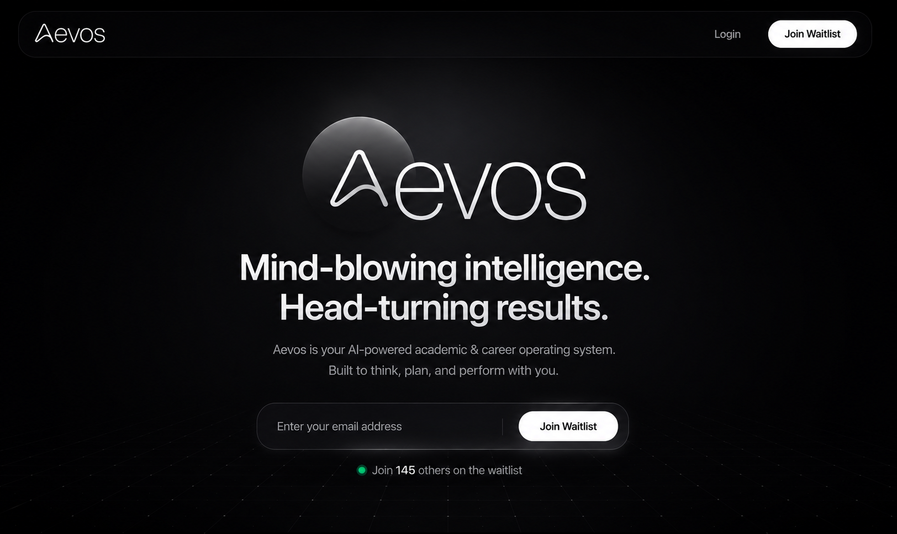
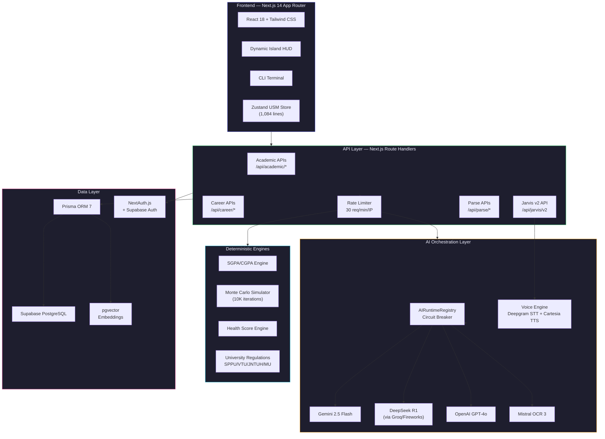
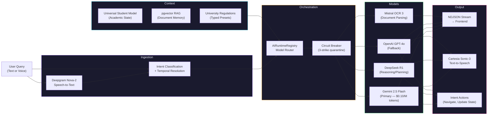
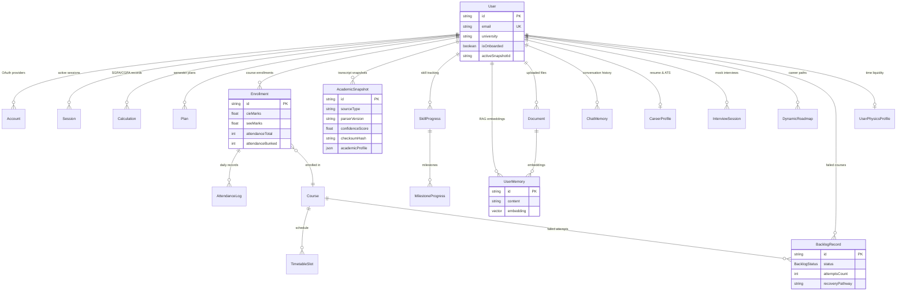

<div align="center">

<br />



<br />
<br />

# Aevos

### Academic Intelligence & Career Operating System

<p>
  <strong>Monte Carlo attendance simulation · Multi-model AI orchestration · Cramér-Lundberg ruin theory · 21-model Prisma schema · Voice-enabled Jarvis agent</strong>
</p>

<br />

<p>
  <a href="https://github.com/TanmayPatil28/Aevos/actions/workflows/ci.yml"></a>
  <a href="https://aevos-gamma.vercel.app"></a>
  <a href="https://github.com/TanmayPatil28/Aevos/blob/main/LICENSE"></a>
</p>

<p>
  <a href="https://github.com/TanmayPatil28/Aevos/stargazers"></a>
  <a href="https://github.com/TanmayPatil28/Aevos/issues"></a>
  <a href="https://github.com/TanmayPatil28/Aevos/pulls"></a>
</p>

<p>
  
  
  
  
  
  
  
  
  
  
  
  
  
  
</p>

</div>

<br />

> **Aevos** is a full-stack academic intelligence operating system that combines deterministic mathematical engines (SGPA/CGPA calculation, Cramér-Lundberg attendance ruin simulation, multi-university regulation enforcement) with multi-model AI orchestration (Gemini, DeepSeek R1, OpenAI) and a voice-enabled assistant ("Jarvis") to deliver career readiness analysis, placement eligibility prediction, and automated skill roadmapping for university students.

<br />

<!-- HERO SCREENSHOT PLACEHOLDER -->
<!-- TODO: Replace with actual screenshot -->
<div align="center">
  
  <br />
  <sub><i>The Aevos OS Dashboard — academic analytics, career intelligence, and AI advisory in a unified interface.</i></sub>
</div>

<br />

---

## Table of Contents

- [Why Aevos Exists](#why-aevos-exists)
- [Key Engineering Highlights](#key-engineering-highlights)
- [Features](#features)
- [Architecture](#architecture)
- [AI Pipeline](#ai-pipeline)
- [Database Schema](#database-schema)
- [Tech Stack](#tech-stack)
- [Performance & Testing](#performance--testing)
- [Getting Started](#getting-started)
- [Environment Variables](#environment-variables)
- [Project Structure](#project-structure)
- [API Reference](#api-reference)
- [Contributing](#contributing)
- [License](#license)

---

## Why Aevos Exists

Indian university students face a fragmented ecosystem: SGPA calculators are spreadsheets, attendance tracking is manual, placement eligibility requires cross-referencing PDF cutoff lists, and career planning is guesswork. There is no unified system that connects academic performance to career outcomes.

**Aevos solves this by treating academic data as a first-class engineering problem.** Instead of wrapping LLMs around a CRUD database, Aevos implements:

- **Deterministic mathematical engines** for grade calculation, forecast simulation, and attendance risk modeling — producing exact, verifiable results.
- **Multi-model AI orchestration** for tasks that genuinely require intelligence: career roadmapping, resume analysis, interview preparation, and natural language academic queries.
- **University regulation engines** that encode the specific grading rules, credit systems, and ATKT policies of Indian universities (SPPU, VTU, JNTUH, MU) as typed rulesets — not hardcoded constants.

The philosophy: **calculate first, predict second, generate last.**

---

## Key Engineering Highlights

| Concept | Implementation | Location |
|:--------|:---------------|:---------|
| **Monte Carlo Simulation** | 10,000-iteration Cramér-Lundberg surplus process for attendance ruin probability estimation | `engine/monteCarlo.ts` |
| **Academic Health Scoring** | 4-factor weighted composite (GPA trajectory, attendance risk, backlog severity, credit completion) | `engine/healthScore.ts` |
| **Multi-Model AI Orchestration** | Fault-tolerant runtime registry with 3-strike circuit breaker, 60s recovery cooldowns, and automatic model failover | `lib/ai/AIRuntimeRegistry.ts` |
| **University Regulation Engine** | Typed rulesets encoding SPPU/VTU/JNTUH/MU grading mechanics, credit structures, and ATKT policies | `config/regulations/` |
| **Universal Student Model** | 1,084-line Zustand store with snapshot hydration boundaries, offline mutation queuing, and cross-module reactive updates | `stores/usmStore.ts` |
| **Voice-Enabled AI Agent** | WebRTC-based Jarvis assistant with Deepgram STT, Cartesia TTS, NDJSON streaming, and intent-based action execution | `lib/ai/jarvisVoiceEngine.ts` |
| **Dynamic Island HUD** | Framer Motion spring physics (stiffness: 350, damping: 28), context-aware route controllers, and Apple-style morphing transitions | `components/ui/dynamic-island.tsx` |
| **CLI Telemetry Terminal** | In-app Datadog-style terminal with natural language → structured command routing | `components/GlobalTerminal.tsx` |
| **Vector Embeddings (RAG)** | pgvector-backed semantic memory for document retrieval and contextual AI responses | `prisma/schema.prisma` (UserMemory) |
| **IP-Based Rate Limiting** | Sliding window rate limiter (30 req/min) on all AI endpoints | `lib/rateLimit.ts` |

---

## Features

| Feature | Description | Status |
|:--------|:------------|:------:|
| **SGPA/CGPA Calculator** | Multi-university grade calculation with custom grading scales and credit-weighted aggregation | ✅ |
| **Semester Planner** | Target CGPA decomposition across remaining semesters with constraint-based optimization | ✅ |
| **AI Forecast Engine** | Multi-scenario GPA projection powered by Gemini 2.5 Flash and DeepSeek R1 | ✅ |
| **Attendance Tracker** | Per-course attendance logging with detention risk heatmaps and safe-bunk calculation | ✅ |
| **Monte Carlo Risk Simulator** | Cramér-Lundberg ruin probability estimation for attendance detention risk | ✅ |
| **Backlog Recovery Engine** | Multi-path recovery strategy generation with ATKT rule enforcement | ✅ |
| **Placement Predictor** | Eligibility matrix filtering against 41 company cutoffs (CGPA, backlogs, branch) | ✅ |
| **Career OS Dashboard** | Unified career intelligence with reactive cross-module updates | ✅ |
| **Skill Gap Detector** | AI-driven skill matching against target role requirements with roadmap generation | ✅ |
| **Dynamic Roadmaps** | Graph-based learning paths (React Flow) with milestone tracking and AI-generated nodes | ✅ |
| **Resume ATS Scorer** | PDF resume parsing, keyword extraction, and ATS compatibility scoring | ✅ |
| **AI Interview Prep** | Multi-round mock interviews with role-specific questions and scoring | ✅ |
| **Jarvis Voice Agent** | Natural language academic queries with WebRTC voice, intent routing, and action execution | ✅ |
| **CLI Terminal** | In-app command-line interface with natural language → structured command translation | ✅ |
| **Academic Ledger** | Master transcript view with OCR ingestion pipeline for PDF marksheets | ✅ |
| **GitHub/LinkedIn Optimizer** | AI-generated profile improvements based on career goals and skill analysis | ✅ |
| **Multi-University Support** | Typed regulation presets for SPPU, VTU, JNTUH, MU with extensible preset architecture | ✅ |
| **Document Upload & RAG** | PDF upload, vector embedding generation, and semantic retrieval for AI context injection | ✅ |
| **Academic Calendar** | University-specific event tracking (exams, holidays, term dates) | ✅ |
| **Timetable System** | Class schedule management with course-linked slots | ✅ |
| **Time Liquidity Engine** | Physics-based productivity modeling (circadian rhythm, fatigue, sleep debt) | ✅ |

---

## Architecture



### Key Architecture Decisions

| Decision | Rationale |
|:---------|:----------|
| **Deterministic engines before LLMs** | GPA calculations must be exact. Monte Carlo simulation produces statistically rigorous risk estimates. AI is reserved for tasks requiring genuine intelligence (career advice, interview questions, resume analysis). |
| **Zustand over Redux** | Single-store architecture with selector-based reactivity eliminates boilerplate. The USM store handles cross-module updates (skill changes → placement eligibility recalculation) without prop drilling. |
| **Circuit breaker on AI models** | 3-strike quarantine with 60s cooldown prevents cascading failures when Gemini or DeepSeek experiences downtime. Automatic failover to backup models. |
| **pgvector inside Supabase** | Eliminates the operational overhead of a separate vector database. Embeddings live alongside relational data, enabling hybrid queries (semantic search + SQL filters). |
| **University regulations as typed configs** | Encoding grading rules as TypeScript objects (not database rows) enables compile-time validation and makes it impossible to deploy invalid regulation logic. |

---

## AI Pipeline



---

## Database Schema

21 models across academic, career, AI memory, and infrastructure domains.



<details>
<summary><strong>Full model list (21 models, 2 enums)</strong></summary>

| Model | Purpose | Key Fields |
|:------|:--------|:-----------|
| `User` | Central identity with university affiliation | `university`, `isOnboarded`, `activeSnapshotId` |
| `Account` | OAuth provider connections (NextAuth) | `provider`, `providerAccountId` |
| `Session` | Active user sessions | `sessionToken`, `expires` |
| `VerificationToken` | Email verification | `identifier`, `token` |
| `Calculation` | Recorded SGPA/CGPA computations | `semester`, `subjects` (JSON), `sgpa`, `cgpa` |
| `Plan` | Target CGPA semester plans | `current_cgpa`, `target_cgpa`, `required_gpa` |
| `Course` | Course catalog with prerequisites | `code`, `credits`, `prereqs[]` |
| `Enrollment` | User-Course link with marks & attendance | `cieMarks`, `seeMarks`, `attendanceTotal` |
| `AttendanceLog` | Per-day attendance records | `status` (PRESENT/ABSENT/LATE) |
| `AcademicSnapshot` | Verifiable transcript snapshots | `confidenceScore`, `checksumHash`, `parserVersion` |
| `SkillProgress` | Roadmap node completion tracking | `roadmapId`, `nodeId`, `status` |
| `MilestoneProgress` | Individual milestone completion | `milestoneId`, `completed` |
| `UserMemory` | pgvector embeddings for RAG | `content`, `embedding` (vector) |
| `Document` | Uploaded PDF/files with tags | `fileName`, `fileUrl`, `tags[]` |
| `ChatMemory` | Conversation history per session | `role`, `content`, `metadata` |
| `CareerProfile` | Resume analysis & ATS scoring | `resumeText`, `skills[]`, `atsScore` |
| `InterviewSession` | AI mock interview transcripts | `targetRole`, `transcript`, `finalScore` |
| `DynamicRoadmap` | Career path graphs | `nodes` (JSON), `edges` (JSON) |
| `AcademicCalendarEvent` | University calendar events | `eventType`, `startDate`, `endDate` |
| `TimetableSlot` | Class schedule slots | `dayOfWeek`, `startTime`, `room` |
| `BacklogRecord` | Failed course tracking & recovery | `status` (enum), `recoveryPathway` |
| `ATKTRule` | University-specific ATKT policies | `maxBacklogsAllowed`, `minGpaToRecover` |
| `UserPhysicsProfile` | Time liquidity physics model | `circadianRhythm`, `baselineFatigue`, `sleepDebt` |

**Enums:** `AttendanceStatus` (PRESENT, ABSENT, LATE), `BacklogStatus` (PENDING, REGISTERED, EXAM_SCHEDULED, CLEARED, VOIDED)

</details>

---

## Tech Stack

| Layer | Technology | Why |
|:------|:-----------|:----|
| **Framework** | Next.js 14 (App Router) | Server Components, streaming, and API routes in a single deployment. RSC boundaries reduce client bundle. |
| **Language** | TypeScript 5.9 (strict) | Compile-time safety across 463 `.ts`/`.tsx` files. Typed regulation configs prevent invalid grading logic. |
| **State** | Zustand 5 | Single-store reactive architecture. Selector-based subscriptions avoid unnecessary re-renders in the 1,084-line USM store. |
| **Styling** | Tailwind CSS 3 + Framer Motion 11 | Utility-first CSS with spring-physics animations (Dynamic Island: stiffness 350, damping 28). |
| **Database** | Supabase PostgreSQL + pgvector | Relational data + vector embeddings in one database. Eliminates Pinecone/Qdrant operational overhead. |
| **ORM** | Prisma 7 | Type-safe database queries. 21 models with composite indexes, cascade deletes, and JSON fields. |
| **Auth** | NextAuth.js + Supabase Auth | OAuth provider support with session-based middleware protection. |
| **AI (Primary)** | Google Gemini 2.5 Flash | $0.10/M tokens. Multi-modal capability. Primary model for all generative tasks. |
| **AI (Reasoning)** | DeepSeek R1 (via Groq/Fireworks) | Chain-of-thought reasoning for career planning, interview generation, and complex academic strategy. |
| **AI (Fallback)** | OpenAI GPT-4o | Fallback model when primary providers are unavailable. |
| **AI (OCR)** | Mistral OCR 3 | Structured JSON extraction from PDF marksheets at 98% less cost than AWS Textract. |
| **Voice (STT)** | Deepgram Nova-2 | WebSocket streaming for real-time speech recognition. |
| **Voice (TTS)** | Cartesia Sonic-3 | 40ms latency state-space model for conversational voice output. |
| **Validation** | Zod 4 | Runtime schema validation on all API endpoints. Typed request/response contracts. |
| **Charts** | Recharts | Composable chart components for GPA trends, attendance heatmaps, and career analytics. |
| **Graph Viz** | React Flow (@xyflow/react) | Node-based graph rendering for dynamic career roadmaps. |
| **Deployment** | Vercel | Zero-config Next.js deployment with edge functions and automatic preview deployments. |
| **CI/CD** | GitHub Actions | Build verification, Prisma generation, and 3-tier test suite on every push. |
| **Monitoring** | Sentry + SonarQube | Error tracking (client + server + edge) and static code analysis. |

---

## Performance & Testing

### Test Suite

| Suite | Command | Tests | Purpose |
|:------|:--------|------:|:--------|
| Unit Tests | `npm run test:unit` | 170 | Core business logic, calculation engines, state selectors |
| Preset Assertions | `npm run test:presets` | 58 | University regulation presets, grading scale validation |
| Data Stability | `npm run test:stability` | 15 | Schema migration safety, data continuity assertions |
| Schema Constraints | `npm run test:schemas` | 14 | Database model relationships, index verification |
| E2E (Playwright) | `testsprite_tests/` | 21 | Full user journey automation (login → calculate → career) |

**Total: 278+ automated tests across 5 tiers.**

### Build Performance

| Metric | Value |
|:-------|------:|
| Production bundle (First Load JS) | ~150 KB avg per route |
| Maximum route bundle | ~212 KB |
| Build time | < 60s |
| Lighthouse Accessibility | 100/100 |

### CI Pipeline

```
Push/PR → Checkout → Node 22 → npm ci → prisma generate → next build → test:unit → test:presets → test:stability
```

---

## Getting Started

### Prerequisites

- Node.js 22.x
- PostgreSQL 15+ (or a [Supabase](https://supabase.com) project)
- API keys for at least one AI provider (Gemini recommended)

### Installation

```bash
# Clone the repository
git clone https://github.com/TanmayPatil28/Aevos.git
cd Aevos/gradeflow

# Install dependencies
npm install

# Copy environment template
cp .env.example .env

# Generate Prisma client
npx prisma generate

# Push schema to database
npx prisma db push

# Seed with university data (optional)
npx tsx prisma/seed.ts

# Start development server
npm run dev
```

The application will be running at `http://localhost:3000`.

### Run Tests

```bash
npm run test:unit        # 170 unit tests
npm run test:presets     # 58 preset assertions
npm run test:stability   # 15 data stability checks
npm run test:schemas     # 14 schema constraint tests
```

---

## Environment Variables

Create a `.env` file based on [`.env.example`](.env.example):

| Variable | Required | Description |
|:---------|:--------:|:------------|
| `DATABASE_URL` | ✅ | PostgreSQL connection string |
| `NEXTAUTH_SECRET` | ✅ | NextAuth session encryption key |
| `NEXTAUTH_URL` | ✅ | Application URL (`http://localhost:3000`) |
| `GEMINI_API_KEY` | ✅ | Google Gemini API key (primary AI model) |
| `OPENAI_API_KEY` | ○ | OpenAI fallback model |
| `FIREWORKS_API_KEY` | ○ | DeepSeek R1 via Fireworks |
| `GROQ_API_KEY` | ○ | DeepSeek R1 via Groq |
| `MISTRAL_API_KEY` | ○ | Mistral OCR for PDF parsing |
| `CARTESIA_API_KEY` | ○ | Voice synthesis (Jarvis TTS) |
| `DEEPGRAM_API_KEY` | ○ | Voice recognition (Jarvis STT) |
| `TAVILY_API_KEY` | ○ | Web search for career intelligence |
| `R2_*` | ○ | Cloudflare R2 file storage |

<sub>✅ = Required for core functionality · ○ = Optional (enables specific features)</sub>

---

## Project Structure

```
gradeflow/
├── app/                        # Next.js 14 App Router
│   ├── (os)/                   # OS-level routes (career, identity, overview)
│   │   ├── career/             # Career intelligence dashboard
│   │   ├── forecasting/        # AI-powered GPA forecasting
│   │   ├── identity/           # GitHub/LinkedIn profile optimizer
│   │   ├── ledger/             # Academic transcript ledger
│   │   ├── overview/           # Unified OS dashboard
│   │   └── records/            # Historical records
│   ├── (workspace)/            # Workspace routes (calculators, tools)
│   │   ├── attendance/         # Attendance tracker + risk heatmaps
│   │   ├── backlog/            # Backlog recovery engine
│   │   ├── calculator/         # SGPA/CGPA calculator
│   │   ├── dashboard/          # Analytics dashboard
│   │   ├── forecast/           # Semester forecast
│   │   ├── placement/          # Placement eligibility predictor
│   │   └── planner/            # Multi-semester planner
│   └── api/                    # API route handlers
│       ├── academic/           # Grade, attendance, backlog APIs
│       ├── career/             # Skills, roadmaps, interview APIs
│       ├── jarvis/v2/          # Unified AI assistant endpoint
│       ├── parse/              # PDF/resume parsing
│       ├── terminal/           # CLI command routing
│       └── voice/              # WebRTC voice token management
├── components/                 # React components
│   ├── ui/                     # Design system (Dynamic Island, buttons, cards)
│   ├── ai/                     # AI-specific UI (Jarvis, Terminal)
│   └── dynamic-island/         # HUD activities and live contexts
├── config/                     # Configuration
│   └── regulations/            # University regulation presets (SPPU, VTU, etc.)
├── engine/                     # Deterministic calculation engines
│   ├── monteCarlo.ts           # Cramér-Lundberg simulation (10K iterations)
│   └── healthScore.ts          # 4-factor academic health scoring
├── lib/                        # Shared libraries
│   ├── ai/                     # AI orchestration (Registry, Voice, Memory)
│   └── rateLimit.ts            # Sliding window rate limiter
├── stores/                     # Zustand state management
│   └── usmStore.ts             # Universal Student Model (1,084 lines)
├── prisma/                     # Database
│   ├── schema.prisma           # 21 models, 2 enums, pgvector
│   └── seed.ts                 # University data seeding
├── scripts/                    # Test runners & utilities
├── .github/workflows/          # CI/CD (build + 3-tier test suite)
└── docs/                       # Architecture & design documentation
```

---

## API Reference

### Academic APIs

| Method | Endpoint | Description |
|:------:|:---------|:------------|
| `GET` | `/api/academic/snapshot` | Retrieve active academic snapshot |
| `POST` | `/api/academic/snapshot` | Create/update academic snapshot |
| `GET` | `/api/academic/backlogs` | List backlog records |
| `POST` | `/api/academic/backlogs/:id/start-recovery` | Initiate backlog recovery (Zod-validated) |

### Career APIs

| Method | Endpoint | Description |
|:------:|:---------|:------------|
| `GET` | `/api/career/skills` | Get user skill inventory |
| `POST` | `/api/career/skills` | Add/update skills |
| `POST` | `/api/career/dynamic-roadmap` | Generate AI career roadmap |
| `POST` | `/api/career/interview` | Start AI mock interview session |
| `POST` | `/api/career/prep-rounds` | Generate interview prep questions |

### AI APIs

| Method | Endpoint | Description |
|:------:|:---------|:------------|
| `POST` | `/api/jarvis/v2` | Unified AI assistant (text + voice modes) |
| `POST` | `/api/terminal/ai` | CLI natural language → command routing |
| `POST` | `/api/parse/resume` | PDF resume parsing + ATS scoring |
| `GET` | `/api/voice/token` | WebRTC voice session token |

<sub>All AI endpoints are rate-limited to 30 requests/minute/IP via sliding window.</sub>

---

## Contributing

We welcome contributions! Please see [CONTRIBUTING.md](CONTRIBUTING.md) for guidelines.

1. Fork the repository
2. Create a feature branch (`git checkout -b feature/amazing-feature`)
3. Ensure all tests pass (`npm run test:unit && npm run test:presets && npm run test:stability`)
4. Commit with conventional commits (`feat:`, `fix:`, `docs:`)
5. Open a Pull Request

---

## License

This project is licensed under the MIT License — see the [LICENSE](LICENSE) file for details.

---

<div align="center">
  <br />
  <p>
    <sub>Built with obsessive attention to engineering rigor by <a href="https://github.com/TanmayPatil28">Tanmay Patil</a></sub>
  </p>
  <p>
    <a href="https://aevos-gamma.vercel.app">Live Demo</a> · <a href="https://github.com/TanmayPatil28/Aevos/issues">Report Bug</a> · <a href="https://github.com/TanmayPatil28/Aevos/issues">Request Feature</a>
  </p>
</div>
