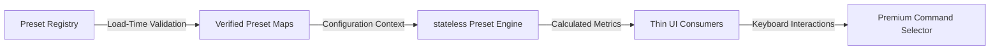

# GradeFlow University Preset System — Architecture & Stabilization Specifications

This document outlines the design, implementation details, validation rules, and future extensibility guidelines for the **GradeFlow University Preset System**. This infrastructure serves as the core intelligence engine of GradeFlow, transforming the platform into a university-driven academic simulation environment.

---

## 1. Architectural Philosophy

The primary objective of the University Preset System is to establish a **mathematically trustworthy, zero-hardcode, and future-safe academic abstraction layer**. 

In conventional academic software, university-specific rules (like grade limits, passing floors, and percentage conversions) are scattered across feature modules. GradeFlow strictly forbids this anti-pattern:

> [!IMPORTANT]
> **STRICT ARCHITECTURAL RULE:**
> No university-specific code branches (`if (preset.id === "sppu")`, `switch (university)`) are permitted inside page containers, calculator forms, or UI components. All feature pages must act as **thin consumers** of data and calculations, driven entirely by the selected institution's preset configuration.

### System Data Flow Direction


---

## 2. Component Design & Abstraction Layers

The preset system is divided into four cleanly isolated modules under `lib/presets/`:

### 2.1 The Data Foundation Layer (`types/universityPreset.ts`)
Defines the `UniversityPreset` TypeScript interface with rich, forward-compatible metadata fields. It captures every dimensional parameter of a university grading system:
* **Identification & Versioning**: `id`, `name`, `shortName`, `canonicalInstitutionId` (grouping historical regulation variations), `version` (schema tracking), and `regulationYear`.
* **Academic Flags**: `country` (for international scale adaptation), `gradingSystem` notation, and `nepAligned` (flagging compatibility with India's National Education Policy structures).
* **Grade Scale Entries**: Array of `GradeScaleEntry` representing alphabetical grades, points, passing status, and absolute percentage bounds (`minMarks`).
* **Dynamic Formula Strings**: Formats for SGPA/CGPA evaluation and percentage conversions.
* **Special Sub-Systems**: Policies for backlog limits, Year Down progressions (`backlogPolicy`), practical/theory weight separations (`assessmentScheme`), and relative grading statistics (`relativeGrading`).

### 2.2 The Strict Invariant Validator (`presetValidator.ts`)
To ensure mathematical determinism and prevent corrupt presets from breaking calculation screens, the validation engine enforces 8 core invariants:
1. **Identity Integrity**: Checks that IDs strictly match lowercase alphanumeric characters and underscores `^[a-z0-9_]+$`.
2. **Grade Scale Invariants**: Enforces that the grade scale contains a clear fail-state (`isPass === false` or `points === 0`).
3. **Descending Point and Mark Order**: Validates that when entries are sorted by points descending, their `minMarks` are also strictly descending, with no duplicate or overlapping thresholds.
4. **Relative Grading Boundaries**: Enforces that relative presets omit `minMarks` on standard letter entries to prevent surrogate absolute calculations.
5. **Formula Parsing Verification**: Dry-runs percentage conversion strings against the evaluation parser with dynamically calculated values to ensure safe mathematical compilations.
6. **Numerical Limit Guardrails**: Restricts attendance floors, overall averages, and GPA bounds within strict mathematical possibilities (e.g., 0-100 for percentages, 0-10 for GPAs).
7. **Relative statistical Config**: Mandates statistical fields when `evaluationModel` is set to `relative` or `hybrid`.
8. **Degree Classification Alignment**: Prevents overlapping thresholds for graduation honors brackets (e.g., First Class with Distinction vs. First Class).

### 2.3 The stateless Computation Engine (`presetEngine.ts`)
A highly optimized, stateless, and mathematically pure computation layer. It parses university preset parameters to execute core operations:
* **Formula Parser**: Evaluates algebraic expression strings using recursive descent, supporting basic operations (`+`, `-`, `*`, `/`), parentheses, and conditionals `IF(condition, trueExpr, falseExpr)`.
* **Percentage Mappings**: Evaluates dynamic piecewise functions (e.g., Mumbai University's CGPA boundaries) and linear offsets (e.g., SPPU's standard linear scale).
* **GPA Aggregations**: Performs credit-weighted SGPA and semester-weighted CGPA calculations.
* **Audit Course Blocker**: Excludes zero-credit courses from denominators to prevent runtime divide-by-zero crashes.

### 2.4 The Central Registry (`presetRegistry.ts`)
The central directory loading 23 distinct academic institutional configurations. It executes key stabilization patterns:
* **Fast-Fail in Development**: During development, `validateAllPresets()` executes automatically at file load. If a single preset fails validation, it throws a descriptive runtime error, preventing the server from booting.
* **Resilient Production Isolation**: In production, validation errors are caught, logged to telemetry, and the corrupted preset is isolated while the rest of the application runs. If all presets are corrupted, the system falls back gracefully to a verified custom scale.
* **O(1) Static Lookup Map**: Maps preset IDs to static references on load. Lookup requests bypass $O(N)$ linear scans in favor of instantaneous $O(1)$ map lookups (`PRESET_MAP.get(id)`).

---

## 3. High-Precision Verification

GradeFlow implements a dedicated presets test suite in `scripts/test-presets.ts`. Executed using `npm run test:presets`, it guarantees mathematical precision across:

* **MU Piecewise Equations**: Asserts that CGPA = 6.5 converts strictly to 58.15% (lower piecewise interval) and CGPA = 8.0 maps to 71.2% (upper piecewise interval).
* **SPPU Linear Scaling**: Confirms CGPA = 8.0 maps to 72.5% and 10.0 maps to 92.5% via standard $(CGPA - 0.75) \times 10$ conversions.
* **JNTUH Linear Conversions**: Verifies CGPA = 8.0 maps to 75.0% using $(CGPA - 0.5) \times 10$.
* **BITS Pilani Unit Checks**: Asserts credit label is defined as "Units" and maps the unique non-linear scale points (skipping point 3 completely: A=10, B=8, C=6, D=4, E=2, NC=0) correctly.
* **VIT Pune Double Letter Checks**: Confirms alphabetical mappings align with points correctly (AA=10, AB=9, BB=8, BC=7, CC=6, CD=5, DD=4, FF=0).
* **VTU Audit Blocker**: Asserts that zero-credit audit courses are ignored in weighted SGPA denominators.
* **COEP Floor Bounds**: Verifies statistical relative grading metadata holds an absolute passing floor at 30%.
* **SGPA/CGPA Math**: Asserts standard credit-weighted calculators execute with floating-point determinism.

---

## 4. How-To: Adding or Modifying University Presets

When extending GradeFlow's footprints, developers should follow these steps to add a new university:

1. **Research Academic Rules**: Check `app/research/Academic_University_Presets_Research.md` or official academic handbooks for grading scales, formulas, and ATKT limits.
2. **Register the Preset**: Define a new `UniversityPreset` constant inside `lib/presets/presetRegistry.ts`.
3. **Specify Scale & Invariants**:
   * For **absolute** grading: Ensure every letter grade entry has a unique, positive `minMarks` threshold descending alongside points.
   * For **relative** grading: Set `evaluationModel: "relative"` and omit `minMarks` to satisfy the relative grading safety rule.
4. **Append to PRESETS List**: Add the new preset constant to the exported `PRESETS` array at the bottom of `presetRegistry.ts`.
5. **Run Verification**:
   ```bash
   npm run test:presets
   ```
   If there is a validation issue, the registry will throw a descriptive error containing the exact preset, field, and violation reason, enabling immediate debugging.

---

## 5. Future Extensibility

* **Multi-Regulation Regulations**: The `canonicalInstitutionId` and `regulationYear` fields allow developers to deploy different historical patterns (e.g., SPPU 2015 Pattern vs. SPPU 2019 Pattern) while grouping them under a single university brand in search panels.
* **NEP-2020 Alignments**: The `nepAligned` boolean allows features to adapt to new National Education Policy modules, including multi-entry, multi-exit credit bank options (Academic Bank of Credits - ABC integration).
* **International Scales**: Utilizing `country: "US"`, the selector and calculation components scale to 4-point scales, adjusting visual bounds dynamically by querying `getMaxGradePoint(preset)`.
