# GradeFlow: Productization, Engagement, and Growth Blueprint
## Converting Academic verifiability into a Habit-Forming Student Platform

This blueprint outlines the product strategy, behavioral loops, UX/UI frameworks, and monetization mechanics to transition GradeFlow from a mathematically pure, regulation-aware academic operating system into a high-retention, daily-active platform for higher education students. 

---

## 1. Build Lab Product Philosophy
GradeFlow's permanent product design is governed by eight foundational engineering and product principles. Every interface, notification, and algorithm must align with these values:

```
┌─────────────────────────────────────────────────────────────────────────┐
│                       BUILD LAB PRODUCT PRINCIPLES                      │
├─────────────────────────────────────┬───────────────────────────────────┤
│ 1. Deterministic before AI          │ 2. Explainability before Autom.   │
├─────────────────────────────────────┼───────────────────────────────────┤
│ 3. Mobile before Desktop            │ 4. Trust before Engagement        │
├─────────────────────────────────────┼───────────────────────────────────┤
│ 5. Execution before Research        │ 6. Simplicity before Scalability  │
├─────────────────────────────────────┼───────────────────────────────────┤
│ 7. Student Agency before Black-Box  │ 8. Motivation before Gamification │
└─────────────────────────────────────┴───────────────────────────────────┘
```

1. **Deterministic before AI**: Under no circumstances should predictive AI models generate primary academic results (GPAs, passing targets, ATKT standings). Calculated numbers must rely exclusively on verified, open-source university statutes and deterministic math. AI functions strictly as a supportive recommender layer.
2. **Explainability before Automation**: GradeFlow does not present automated scores without context. Every calculated metric must expose its mathematical trace, specific university ordinances, and underlying variables. Students must immediately understand *how* and *why* their scores were computed.
3. **Mobile before Desktop**: Over 85% of Indian higher-education students consume digital utilities on mobile viewports. Every layout must optimize for thumb-zone mechanics, one-hand usability, low-bandwidth campus network connections, and rapid tactile inputs.
4. **Trust before Engagement**: Privacy, security, and algorithmic integrity represent GradeFlow's primary moats. We never leverage dark patterns, sell student profiles, or utilize predictive threat levels to penalize users.
5. **Execution before Research**: Maintain a lean, startup-executable approach. Avoid complex multi-node orchestration, semantic web querying, or predictive telemetry meshes until we secure active user traction. Monolithic, highly optimized Next.js frameworks coupled with clean SQL state schemas take precedence.
6. **Simplicity before Scalability**: Maintain absolute code maintainability. Leverage unified, reusable components with zero custom CSS leaks. Implement clean database indexes to deliver high performance on standard cloud servers.
7. **Student Agency before Black-Box Prediction**: Acknowledge that the student is the ultimate agent of their academic career. Rather than generating opaque "burnout predictors," we expose interactive simulation sandboxes, giving students the variables to model their own recovery paths.
8. **Motivation before Gamification**: Eschew childish, generic gamification triggers (e.g., spinning wheels, virtual coins, flashing sound effects). Higher-education student stress is highly visceral; our interface must feel professional, empathetic, clean, and motivating.

---

## 2. Daily Student Operating Model & Retention Loops
To drive recurring organic usage, GradeFlow models its product flows after high-utility habit-forming engines. We address the core academic stressors students experience throughout a semester:

```mermaid
flowchart TD
    subgraph Loops["CORE BEHAVIORAL RETENTION LOOPS"]
        direction LR
        A1[Daily Attendance Anxiety] -->|Swipe Check-In| R1[Micro Relief & Safe Status]
        A2[CGPA Recovery Goal] -->|Simulator Scenarios| R2[Playable Recovery Paths]
        A3[Placement & Internship Cutoffs] -->|Eligibility Scan| R3[Automated Validation Trace]
        A4[Backlog & ATKT Survival] -->|Progression Solve| R4[Step-by-Step Recovery Plan]
    end
    style Loops fill:#1a1c1d,stroke:#333,stroke-width:2px;
```



### 2.1 The Attendance Anxiety Loop
* **Trigger**: A student wakes up late for an 8:00 AM lecture or faces the temptation to bunk a class.
* **Action**: Opens GradeFlow, selects the active course, and performs a single-swipe decrement ("Bunked") or increment ("Attended").
* **Reward**: Instantly computes class safety. Exposes a visual micro-indicator: *"You can safely bunk 2 more classes in this subject to stay above 75%"* or *"Warning: You must attend the next 4 consecutive lectures to restore 75% attendance."*
* **Retention Mechanism**: A persistent system-tray widget and quick-action lockscreen toggle that reduces friction to a single tap, transforming class bunking from a blind gamble into a deterministic decision.

### 2.2 The CGPA Recovery Loop
* **Trigger**: Release of Continuous Internal Evaluation (CIE) marks or mid-semester exams.
* **Action**: Enters actual midterm grades into the Interactive Simulator.
* **Reward**: Solves piecewise linear formulas (e.g., Mumbai University, SPPU) to reveal the exact external exam grade required to preserve or upgrade their CGPA band.
* **Retention Mechanism**: "Required SGPA Slider" which allows students to dynamically visualize how lowering their effort in one subject shifts the weight requirements onto another, fostering continuous re-evaluation during exam preparation weeks.

### 2.3 The Internship & Placement Eligibility Loop
* **Trigger**: On-campus placement cell (TPO) publishes a recruiter eligibility checklist (e.g., *"CGPA $\ge$ 7.50, no active backlogs"*).
* **Action**: Student loads their academic profile on GradeFlow and clicks "Check Eligibility."
* **Reward**: Renders a standard-compliant verification badge proving eligibility. If ineligible, it displays a standard-deviation target forecasting if a cohort re-grading under VIT relative grading could push them into the cutoff pool.
* **Retention Mechanism**: Real-time push alerts that trigger whenever an upcoming semester's simulated grades shift their state from "Ineligible" to "Eligible" across targeted Tier-1 product companies.

### 2.4 The Backlog (ATKT) Survival Loop
* **Trigger**: Receiving an F-grade or failing a critical prerequisite course.
* **Action**: Feeds grades into the ATKT Progression Solver.
* **Reward**: The solver runs university-specific promotion rules (e.g., MIT-WPU credit gates) and constructs a granular, step-by-step academic survival track outlining exactly which backlog exams must be cleared in the winter/summer sessions to avoid a Year-Down (detention).
* **Retention Mechanism**: A countdown tracker showing days until backlog registrations, mapped against required preparation checkpoints.

---

## 3. Core Product Surfaces

### 3.1 Student Command Center (Mobile-First Hub)
* **Purpose**: Serve as the default workspace landing page. Renders a unified, high-density visualization of the student's current academic, attendance, and placement state.
* **Primary Metrics**: Live Cumulative GPA, Global Attendance Score, Active Backlog Counter, and Placement Readiness Index.
* **State Dependencies**: Zustand `usmStore` (Unified Student State Machine) and `presetRegistry`.
* **UI Complexity**: Medium-High. Features compact, responsive data cards with smooth micro-animations.
* **Mobile Behavior**: Bottom-navigation anchored. Uses a swipe-down panel to search university codes.
* **MVP Priority**: **Critical (P1)**.

### 3.2 Academic Health Dashboard (High-Fidelity Visualizer)
* **Purpose**: Present historical academic progression (CGPA) and semester-over-semester trends.
* **Primary Metrics**: Semester SGPA, Cumulative CGPA, Earned vs. Required Credits, and Grade Distribution Breakdown.
* **State Dependencies**: `prisma` database queries, `presetEngine`, and `gpaConverter`.
* **UI Complexity**: Medium. Implements responsive, non-blocking area charts (Recharts) with custom dark-mode styling.
* **Mobile Behavior**: Auto-collapsing legends. Full-screen gesture swipe to navigate between academic years.
* **MVP Priority**: **High (P1)**.

### 3.3 Risk & Recovery Center
* **Purpose**: Provide active academic remediation and safety nets for students falling below passing thresholds.
* **Primary Metrics**: Course Risk Indexes, CIE Fail Warnings, Year-Down Detention Risk, and ATKT Credit deficit.
* **State Dependencies**: `progressionSolver` and `aiAdvisoryEngine`.
* **UI Complexity**: Low. Displays high-contrast alert cards with action-oriented buttons.
* **Mobile Behavior**: Anchored banner alerts. One-tap navigation to contact advisors or register for backlog exams.
* **MVP Priority**: **High (P1)**.

### 3.4 Semester Simulation Sandbox
* **Purpose**: Allow students to experiment with hypothetical grades to map out optimum GPA trajectories.
* **Primary Metrics**: Target CGPA, Simulated Semester SGPA, and Subject-wise Internal/External Marks Splits.
* **State Dependencies**: `presetEngine` mapping systems, dynamic calculators.
* **UI Complexity**: High. Uses drag-to-slide grade mappers, real-time recalculations, and dynamic validation.
* **Mobile Behavior**: Tactile sliding controls optimized for thumb zones. Bottom-sheet modals for selecting hypothetical grades.
* **MVP Priority**: **Critical (P1)**.

### 3.5 Placement Eligibility Center
* **Purpose**: Translate standard academic statistics into corporate recruiting compliance values.
* **Primary Metrics**: WES US 4.0 Equivalent GPA, Standard Percentile Ranking, eligible company count, and placement exam suitability.
* **State Dependencies**: `gpaConverter` and cohort statistical datasets.
* **UI Complexity**: Medium. Showcases corporate readiness scores, WES equivalence certificates, and PDF transcript exporters.
* **Mobile Behavior**: Linear lists with filter tags. Clean sharing hooks to WhatsApp, LinkedIn, and email.
* **MVP Priority**: **Medium (P2)**.

### 3.6 Attendance Intelligence Panel
* **Purpose**: Eradicate attendance calculation errors and empower students to manage their class schedules.
* **Primary Metrics**: Current attendance percentage, maximum consecutive bunkable classes, and attend-to-recover targets.
* **State Dependencies**: Local database storage linked with semester course structures.
* **UI Complexity**: Medium. Includes visual gauges that shift from green to amber and red.
* **Mobile Behavior**: Giant radial progress ring with quick +1/-1 floating action buttons.
* **MVP Priority**: **High (P1)**.

### 3.7 Skill Roadmap Workspace
* **Purpose**: Bridge academic outcomes with career-readiness, highlighting critical skill acquisitions.
* **Primary Metrics**: Prerequisite curriculum DAG matches, project repository scores, and coding platform rankings.
* **State Dependencies**: User profile configurations, external API adapters.
* **UI Complexity**: High. Displays course trees and connection maps.
* **Mobile Behavior**: Zoom-and-pan canvas optimization. Smooth vertical cards for linear roadmaps.
* **MVP Priority**: **Low (P3)**.

### 3.8 Academic Audit & Explainability Layer
* **Purpose**: Deliver an transparent overlay explaining every calculation to establish user trust.
* **Primary Metrics**: Confidence Score, Rule Source References, and Piecewise Target Ranges.
* **State Dependencies**: `presetValidator` diagnostics and raw calculation traces.
* **UI Complexity**: Low. Collapsible, clean markdown sheets containing math formulas.
* **Mobile Behavior**: Slide-up bottom sheets triggered by tapping a "Why this result?" icon.
* **MVP Priority**: **High (P1)**.

---

## 4. Trust-First UX System (Transparancy & Auditability)
To ensure students never view GradeFlow as a "black-box predictor," we deploy an absolute transparency framework across the UI:

```
┌─────────────────────────────────────────────────────────────────────────┐
│                    TRUST-FIRST UX INTERACTION SYSTEM                    │
├─────────────────────────────────────────────────────────────────────────┤
│                                                                         │
│  [Subject: Math III]                      [Calculated GPA: 8.42 / 10]   │
│  ─────────────────────────────────────────────────────────────────────  │
│  Confidence Level: 100% Verified [✓]  |  Source Ordinance: SPPU-NEP2020 │
│                                                                         │
│  ┌───────────────────────────────────────────────────────────────────┐  │
│  │ 🔍 Why this result? (Tap to expand)                              │  │
│  ├───────────────────────────────────────────────────────────────────┤  │
│  │ Formula applied: SGPA = Σ(Credit × GradePoint) / ΣCredits         │  │
│  │                                                                   │  │
│  │ Step 1: Weighted Points = (4 × 9) + (3 × 8) + (3 × 8) = 84        │  │
│  │ Step 2: Total Credits    = 4 + 3 + 3 = 10                         │  │
│  │ Step 3: Raw Result       = 84 / 10 = 8.40                         │  │
│  │ Step 4: SPPU Rule 7.2    = +0.02 grace adjustment for CIE safety  │  │
│  │                                                                   │  │
│  │ Verified Source Document:                                         │  │
│  │ [SPPU Acad. Council Res. 14/2022 (Page 4)](file:///docs/sppu_rules.pdf)│  │
│  └───────────────────────────────────────────────────────────────────┘  │
│                                                                         │
└─────────────────────────────────────────────────────────────────────────┘
```

1. **Explainability Overlays & Formula Trace Viewers**: Every computed grade or SGPA card features an inline "Why this result?" trigger. Tapping it opens a clean overlay detailing:
   * The raw formula applied.
   * Step-by-step arithmetic substituting the student's actual values.
   * Floating-point precision values before rounding.
2. **Regulation Source Cards**: Direct hyperlinks to original university PDF guidelines. We display exact page and paragraph references (e.g., *"Mumbai University Circular UG-14/2021, Page 3, Section 4.2"*), anchoring calculations in official university policies.
3. **Confidence Indicators**: Visual confidence meters on every preset profile:
   * `[99% - Official Preset]`: Direct mapping from verified university statutes.
   * `[75% - Community Contributed]`: Peer-reviewed and community verified, but awaiting official audit certification.
4. **Validation Badges**: If a preset has passed our automated `presetValidator` checks (e.g., no overlapping grades, monotonic scaling, strict credit boundary gates), it displays a green shield icon: `[Math Checked & Verified]`.
5. **Isolation Fallback Warnings**: If a community-built preset fails any validator tests, the system isolates it instantly. The UI renders a warning banner: *"Warning: This preset has been isolated due to a mathematically conflicting grade scale (Rule overlaps detected). Grade calculations have safely fallen back to the Standard Academic Model to prevent errors."*
6. **Estimated Equivalency Disclaimers**: Whenever a student views international conversions (e.g., WES US 4.0 or ECTS standing), we display a mandatory, prominent footer: *"Disclaimer: WES and ECTS conversions are estimated calculations based on standard international conversion guides. Official evaluations are performed exclusively by the target institutions."*

---

## 5. Unified Student State Machine (USM) UX Mapping
We map the state changes within the Zustand store (`usmStore.ts`) to specific interface behaviors, triggers, and support resources:

| State Dimension | State Value | UI Visual Cue | Trigger Point | Recommended Action / Intervention |
| :--- | :--- | :--- | :--- | :--- |
| **Academic State** | `PERFECT` | Pulsing Gold Border, Glowing Badge | $CGPA \ge 9.50$ | Offer target company eligibility checklist & peer tutor signup invitation. |
| | `STABLE` | Emerald Green Theme, Checkmark Icon | $7.00 \le CGPA < 9.50$ | Suggest target subjects to push into the `PERFECT` band next semester. |
| | `RISK` | Warm Amber Theme, Exclamation Badge | $5.00 \le CGPA < 7.00$ | Launch the Target GPA Simulator to chart a recovery path. |
| | `ATKT_DANGER` | High-Contrast Orange Border, Alert Flasher | CGPA $< 5.00$ or Earned Credits $< 50\%$ | Load the MIT-WPU Backlog Solver. Map the summer/winter exam schedule. |
| | `DETAINED` | Dark Crimson Overlay, Blocked Shell | Unresolved ATKTs, credit gate failure | Lock feature access. Load a Year-Down counseling portal with recovery steps. |
| **Risk State** | `SAFE` | Muted Gray Text, Stable Status | Low backlog probability | Normal dashboard operations. |
| | `ELEVATED` | Amber Warning Ribbon, Warning Text | Prerequisite subject failed | Highlight future courses blocked by active prerequisite gaps. |
| | `CRITICAL` | Flashing Red Banner, Blinking Badge | Crucial prerequisite failed | Launch the "Prerequisite Path Unlock Simulator" to minimize timeline delays. |
| **Attendance State**| `EXCELLENT` | Radiant Green Ring | $Attendance \ge 85\%$ | *"Attendance safe. You can safely bunk up to 3 classes in this subject."* |
| | `AMBER` | Soft Orange Ring | $75\% \le Attendance < 85\%$ | *"Warning: Attendance near cutoff. You must attend the next 2 lectures."* |
| | `CRITICAL` | Pulsing Red Gauge | Attendance $< 75\%$ | *"Action Required: You are ineligible for exams. Attend the next 5 classes."* |
| **Placement State** | `ELIGIBLE` | Glowing Green Check, Verified Badge | Meets target company CGPA & lack of backlogs | Open direct resume sharing and export a validated GPA transcript. |
| | `TARGET` | Hollow Circle, Target CGPA indicator | $CGPA < CompanyCutoff$ within 0.5 points | Renders target grade required in active courses to meet the placement cutoff. |
| | `INELIGIBLE` | Muted Red Cross, Locked Status | Backlog present, CGPA deficit $>0.5$ | Display warning showing which active backlog is blocking placement eligibility. |

---

## 6. Mobile-First Experience Strategy
Indian higher-education students rely heavily on mobile-first environments, characterized by slow campus network speeds, high screen-glare, and rapid physical interactions.

```
┌──────────────────────────────────────┐
│           THE ONE-HAND SHELL         │
├──────────────────────────────────────┤
│                                      │
│                                      │
│                                      │
│                                      │
│        [ Active Workspace ]          │
│                                      │
│  ┌────────────────────────────────┐  │
│  │     THUMB INTERACTION ZONE     │  │
│  │                                │  │
│  │   [Swipe Attendance]           │  │
│  │   [Drag Target Slider]         │  │
│  │   [Trigger Quick Search]       │  │
│  └────────────────────────────────┘  │
│                                      │
├──────────────────────────────────────┤
│  [Center]  [Simulator]  [Backlogs]   │
└──────────────────────────────────────┘
```

1. **Responsive Shell Architecture & Thumb-Zone Optimization**:
   * All primary navigation controls, quick-input buttons, and sliders must sit inside the lower 40% of the screen (the comfortable thumb-swipe reach zone).
   * Headers and navigation bars collapse automatically on scroll to maximize active screen real estate.
   * We replace click-heavy drop-downs with smooth, interactive bottom sheets that slide up elegantly on tap.
2. **Command-Sheet Navigation**:
   * A persistent search bar sits at the bottom-center of the screen. Tapping it opens a full-screen, quick-search command sheet.
   * Using fuzzy search logic, students can find presets, input hypothetical grades, or access specific subjects with minimal keystrokes.
3. **Offline-First & Low-Bandwidth Operations**:
   * All calculated metrics, inputted marks, and local state indices are stored locally via Zustand's index-persisters inside IndexedDB.
   * The app launches instantly in offline mode and computes academic formulas locally. Data synchronizes silently with the central database when a stable internet connection is restored.
   * Large static images are replaced with optimized SVG iconography, keeping initial load payloads under 150 KB.
4. **One-Hand Usability & Quick Grade Input Systems**:
   * We replace tiny, hard-to-target numeric text boxes with large sliding dials, custom increment/decrement controls, and gesture-driven grade Select cards.
   * Inputting a full semester's worth of grades can be executed in under 30 seconds using single-tap, structured input matrices.

---

## 7. High-Fidelity Data Entry & OCR Experience
Manual data entry of historical transcripts is a primary friction point for new users. GradeFlow eliminates this bottleneck with a fast, verified transcription engine:

```
┌─────────────────────────────────────────────────────────────────────────┐
│                     OCR VERIFICATION & EDITING GRID                     │
├─────────────────────────────────────────────────────────────────────────┤
│                                                                         │
│   [Uploaded: sppu_sem3.jpg]                  System Confidence: 94%     │
│   ───────────────────────────────────────────────────────────────────   │
│                                                                         │
│   Parsed Rows (Tap any cell to correct):                                │
│                                                                         │
│   Subject Code    Credits     Grade Parsed    Validation Status         │
│   ───────────────────────────────────────────────────────────────────   │
│   CS-301          4           [ A ]           [✓] Safe                  │
│   CS-302          3           [ B+ ]          [✓] Safe                  │
│   M-303           4           [ F ]  ⚠️       [?] Out of Grade Range   │
│                                                                         │
│   ┌───────────────────────────────────────────────────────────────────┐ │
│   │ ⚠️ Validation Alert: Subject M-303 was parsed with grade 'F'.     │ │
│   │ Please verify this matches your physical marksheet before saving. │ │
│   └───────────────────────────────────────────────────────────────────┘ │
│                                                                         │
│                    [Cancel]          [Confirm & Save]                   │
└─────────────────────────────────────────────────────────────────────────┘
```

1. **Image Upload & OCR Processing**:
   * Students snap a clear photo or upload a screenshot of their university marksheet.
   * An edge-detection scanner highlights the document bounds in real time to ensure optimal framing before submission.
2. **Interactive OCR Correction Grid**:
   * Parsed data is never committed silently. The system maps parsed values directly to an editable spreadsheet grid.
   * Every parsed cell highlights its status: green for high confidence, orange for low confidence, and red for parsed anomalies.
   * Students can easily correct values with a single tap to open a focused mobile selector.
3. **Confidence Scoring**:
   * The parser calculates an overall sheet confidence metric based on character sharpness, formatting alignment, and dataset matching.
   * If confidence drops below 85%, the interface prompts: *"We encountered some low-contrast areas. Please review the highlighted rows to ensure accuracy."*
4. **Manual Override & Audit Workflows**:
   * We enforce a two-step validation gateway. Tapping "Confirm & Save" prompts the user to verify: *"I confirm that these 6 subjects match my physical marksheet."*
   * The original uploaded image is stored in compressed storage, allowing users to toggle a split-screen view to audit their values at any time.

---

## 8. Professional Gamification & Retention Systems
GradeFlow implements a clean, career-oriented motivation framework tailored for professional growth:

1. **Semester Survival Milestones**:
   * Visual progress bars that track the completion of key milestones throughout a semester (e.g., *"Midterms Completed"*, *"CIE Safety Locked"*, *"Final Prep Mode"*).
   * Motivates students by visually breaking down a stressful 4-month semester into small, highly achievable segments.
2. **Academic Recovery Badges**:
   * Generates discrete, professional achievement highlights to celebrate hard-earned improvements (e.g., *"SGPA Upgrade: +1.2 improvement"* or *"Perfect Attendance Streak: 15 consecutive lectures"*).
   * Focuses on growth metrics rather than static high scores, validating students who successfully navigate academic recovery.
3. **Improvement Tracking Graphs**:
   * Renders personalized trendlines plotting academic progress semester-over-semester.
   * Highlights long-term resilience, reminding students that early academic setbacks can be successfully mitigated by steady improvement.
4. **Placement Readiness Index**:
   * Aggregates CGPA, backlog status, verified skills, and project scores into a comprehensive Placement Readiness rating.
   * Provides students with clear, actionable insights into how upgrading their grades directly increases their eligibility across targeted industries.

---

## 9. Career Infrastructure for Students
GradeFlow connects academic performance with tangible career opportunities, transforming academic data into a springboard for professional growth:

```mermaid
graph LR
    subgraph Career["CAREER INFRASTRUCTURE WORKFLOWS"]
        direction TB
        G1[Verified Academic Profile] -->|Automatic Eligibility Analysis| P1[Target Company Match Matrix]
        P1 -->|Identify Target Gaps| R1[Simulation Target Generator]
        R1 -->|Suggest Next Semester Grades| G1
        G1 -->|Export Standard GPA| T1[WES US 4.0 Verified Transcript]
    end
    style Career fill:#1a1c1d,stroke:#333,stroke-width:2px;
```



1. **Eligibility Analysis**:
   * Maps student profiles against the hiring guidelines of top global and local technology companies.
   * Highlights specific academic requirements, showing students exactly how their current GPA compares to historic corporate cutoffs.
2. **Simulation Target Generator**:
   * If a student falls short of their target company's GPA cutoff, the system dynamically calculates the required grades in active subjects to bridge the gap.
   * Motivates exam preparation by connecting academic performance directly with preferred career trajectories.
3. **WES US 4.0 Verified Transcript Exporter**:
   * Generates a clean, professional PDF transcript mapping local university percentages to standardized WES US 4.0 formats.
   * Includes detailed methodology statements, giving students a credible asset to share with global recruiters and academic advisors.
4. **Skills Alignment Engine**:
   * Matches curriculum paths with standard corporate skill sets.
   * Identifies theoretical concepts from the classroom and recommends corresponding real-world open-source repositories to build practical skills.

---

## 10. Monetization Strategy & Psychology
GradeFlow builds trust by maintaining absolute clarity on what is free, what is premium, and why we charge:

### 10.1 The Free Tier (Standard Access)
* **What is Included**:
  * Unlimited manual GPA calculation and standard semester planning.
  * Access to the complete verified University Preset Registry.
  * Essential single-subject attendance logging.
  * Interactive target simulation tool.
* **Why it remains Free**: To serve as a high-value utility accessible to every student, building an active community and driving organic growth.

### 10.2 The Premium Tier (Professional Access)
* **What is Included**:
  * Multi-Semester simulation sandbox mapping multi-year trajectories.
  * High-speed transcript parser utilizing automatic OCR processing.
  * WES US 4.0 conversion maps and standardized PDF transcript exporter.
  * Advanced target analytics showing cohort standard-deviation forecasts.
* **Student Pricing Psychology**:
  * Priced competitively at the cost of a single coffee or campus meal per semester (e.g., ₹199 per semester / ₹349 per year).
  * Focuses on value delivery, ensuring the premium tools are accessible to the average college student.

### 10.3 Institution & Counselor Portals
* **What is Included**:
  * Institutional admin panels designed to analyze aggregate student retention.
  * Academic advisory interfaces to manage student recovery paths.
  * Dynamic preset builder allowing institutions to easily publish custom university guidelines.
* **Pricing Model**: Standard B2B annual software-as-a-service (SaaS) subscription tiers licensed to universities and private college counselors.

---

## 11. MVP Execution Filter & Scoring Matrix
To keep development highly focused and prevent scope creep, every proposed feature must pass a strict scoring gate:

$$\text{Feature Score} = \frac{\text{Daily Utility} \times \text{Trust Impact} \times \text{Retention Potential}}{\text{Implementation Complexity} \times \text{Maintainability Factor}}$$

Each criterion is scored on a scale from `1` to `5`:

| Metric | Score = 1 | Score = 3 | Score = 5 |
| :--- | :--- | :--- | :--- |
| **Daily Utility** | Used once or twice a semester. | Used weekly during term. | Used daily (e.g., attendance anxiety check). |
| **Trust Impact** | Zero effect on calculation verifiability. | Displays simple, helpful context. | Validates calculation accuracy against university ordinances. |
| **Retention Potential** | High churn rate after initial setup. | Used periodically to evaluate goals. | Integrates into core habits (e.g., grade updates). |
| **Implementation Complexity** | Simple code tweak ($< 2$ hours). | Moderate work ($1 - 3$ days). | High complexity ($> 1$ week, requires custom engines). |
| **Maintainability Factor** | Zero maintenance required. | Standard database updates needed. | Requires frequent API or third-party config updates. |

### Minimum Viable Product Threshold
* **Feature Score $\ge$ 5.0**: **Approved for MVP build**.
* **Feature Score < 5.0**: **Deferred to Phase B (Growth) or Phase C (Scale)**.

---

## 12. Build Lab Product Roadmap (Horizon Matrix)

```
                       GRADEFLOW PRODUCT EVOLUTION MAP
                       
       PHASE A (MVP Core)          PHASE B (Growth)         PHASE C (Scale)
     ┌──────────────────────┐    ┌────────────────────┐    ┌─────────────────┐
     │ • Command Center     │───>│ • glpk.js Solver   │───>│ • SWI-Prolog    │
     │ • Attendance Tracker │    │ • Vision OCR Engine│    │   Policy Check  │
     │ • Sandbox Simulator  │    │ • Partner Portal   │    │ • SHAP/LIME ML  │
     │ • Why-This-Result Grid│   │ • Multi-Tenant SaaS│    │ • Kafka telemetry│
     └──────────────────────┘    └────────────────────┘    └─────────────────┘
```

By adhering to this execution-focused roadmap, GradeFlow guarantees that its powerful academic calculation engine transforms into an indispensable, daily-active partner for students, setting a new standard for trust and verifiability in higher education.
